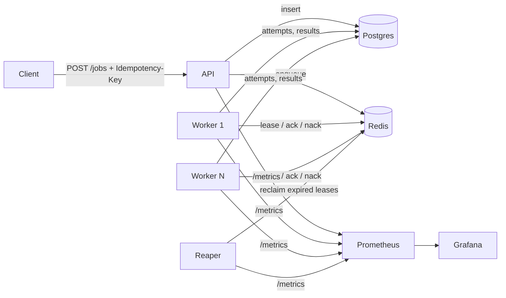

# Project 1: Distributed Job Processing System

**One line:** A job queue where no job is lost or run twice by mistake, even when workers crash mid-task.
**Target:** 4 weeks part-time · **Cost:** $0 · **Build order:** first (Project 3 depends on it)

---

## 1. Goals

- Show **at-least-once delivery with idempotent effects**, i.e. "effectively once".
- Survive worker crashes (`kill -9`) without losing jobs.
- Publish real throughput and latency numbers at 1, 4 and 8 workers.
- Expose a small, reusable client library that Project 3 imports.

## 2. Non-goals (out of scope)

- Multi-region replication or Redis Cluster.
- A web UI beyond Grafana dashboards. Use the API plus Grafana.
- Auth/multi-tenancy (per-tenant limits are a stretch goal only).
- Exactly-once *execution*. We guarantee exactly-once *effect* through idempotency, and the ADR explains why.

## 3. Stack (all free)

| Layer | Choice | Why |
|-------|--------|-----|
| Language | Python 3.12 | Fast to build; asyncio for workers |
| API | FastAPI + Uvicorn | Async, auto OpenAPI docs at `/docs` |
| Broker | Redis 7 / Valkey (Docker) | Sorted sets for delayed and priority jobs, Lua scripts for atomic lease ops |
| Durable store | Postgres 16 (Docker) + SQLAlchemy/asyncpg + Alembic | Job history, attempts, results |
| Metrics | `prometheus_client` → Prometheus → Grafana OSS | Dashboards committed as JSON |
| Logs | `structlog` JSON with `job_id` on every line | |
| Tests | pytest, pytest-asyncio, [testcontainers](https://testcontainers.com) | Real Redis and Postgres in tests, free |
| Load test | k6 or Locust | |
| CI | GitHub Actions (public repo = free) | Service containers for Redis and Postgres |

## 4. Architecture



| Component | Responsibility |
|-----------|----------------|
| **API service** | `POST /jobs` (with `Idempotency-Key` header), `GET /jobs/{id}`, `POST /jobs/{id}/retry`, `GET /dlq`, `POST /dlq/{id}/replay` |
| **Broker (Redis)** | `ready:{priority}` lists/streams, `delayed` sorted set (score = run_at), `inflight` sorted set (score = lease expiry) |
| **Workers** | N processes that lease a job, heartbeat while running, then ack or nack |
| **Reaper** | Finds `inflight` entries with expired leases (crashed worker) and requeues them |
| **Postgres** | `jobs`, `job_attempts`, `idempotency_keys` tables. Source of truth for history. |
| **Observability** | Queue depth, in-flight count, attempts, DLQ size, enqueue-to-start latency histogram |

### Key data model (sketch)

```sql
jobs(id uuid pk, type text, payload jsonb, priority smallint, status text,
     attempts int, max_attempts int, run_at timestamptz, idempotency_key text unique,
     created_at, updated_at, last_error text)
job_attempts(id, job_id fk, worker_id, started_at, finished_at, outcome, error)
```

## 5. Features

### Must-have (MVP)
- [ ] Enqueue / get status / manual retry endpoints
- [ ] Retries with exponential backoff and jitter; max attempts per job type
- [ ] Dead-letter queue with inspect and replay endpoints
- [ ] Leases (visibility timeouts) with heartbeats for long jobs
- [ ] Reaper that requeues jobs whose lease expired
- [ ] Idempotency keys: a duplicate enqueue returns the original job
- [ ] Delayed and scheduled (cron-style) jobs
- [ ] Priority levels (high / normal / low)
- [ ] Graceful shutdown: on SIGTERM, workers finish or release in-flight jobs
- [ ] Backpressure: API returns `429` when queue depth passes a threshold
- [ ] Python client library (`jobq.enqueue(...)`) for Project 3 to import

### Stretch
- [ ] Job dependencies (run B after A succeeds)
- [ ] Per-tenant rate limits and fair scheduling
- [ ] Swap Redis for Postgres `SELECT … FOR UPDATE SKIP LOCKED` and benchmark both in an ADR

## 6. Milestones

| Week | Deliverable | Done when |
|------|-------------|-----------|
| 1 | API, single worker, Postgres schema, happy path end to end | `docker compose up`, enqueue, job completes, status = `succeeded` |
| 2 | Retries, backoff, DLQ, leases and reaper | A failing job lands in the DLQ after N attempts. A `kill -9`'d worker's job is retried. |
| 3 | Idempotency, priorities, scheduling, graceful shutdown | Duplicate-enqueue test passes. SIGTERM loses no jobs. |
| 4 | Metrics dashboard, load test, chaos demo, README and ADRs | All success metrics below are published |

## 7. Success metrics

- **Zero lost jobs** across a test that kills a random worker every 10 seconds (`chaos/kill_random_worker.sh`).
- **Throughput and p99 enqueue-to-start latency** published at 1, 4 and 8 workers.
- **Duplicate-enqueue test:** 1,000 requests, each sent twice, create exactly 1,000 jobs.

## 8. Demo

A 60-second GIF: enqueue 10,000 jobs, `kill -9` two workers mid-run, and watch the Grafana dashboard as leases expire and the count still reaches 10,000 complete.

## 9. ADR candidates

1. Redis vs Postgres `SKIP LOCKED` as the broker
2. At-least-once + idempotency vs trying for exactly-once
3. Lease duration and heartbeat interval: the trade-off between fast recovery and false reclaims
4. Where state lives: Redis for scheduling, Postgres for truth, and how they're kept consistent (and the window where they're not)
5. Backoff strategy (full jitter vs decorrelated jitter)

## 10. Risks

| Risk | Mitigation |
|------|------------|
| Redis and Postgres disagree after a crash between writes | Write to Postgres first (outbox-style). The reaper/reconciler re-derives Redis state from Postgres on startup. |
| Lease too short, so a slow job runs twice | Heartbeats plus idempotent handlers, and document it in an ADR |
| Load numbers skewed by Docker Desktop on macOS | State the hardware and Docker CPU/RAM limits. Optionally rerun on the Oracle free VM. |

## 11. Free hosting (optional)

The whole stack fits on an **Oracle Cloud Always Free** ARM VM. Expose Grafana and the API with **Cloudflare Tunnel**. Run the load test locally, not on hosted free tiers.
