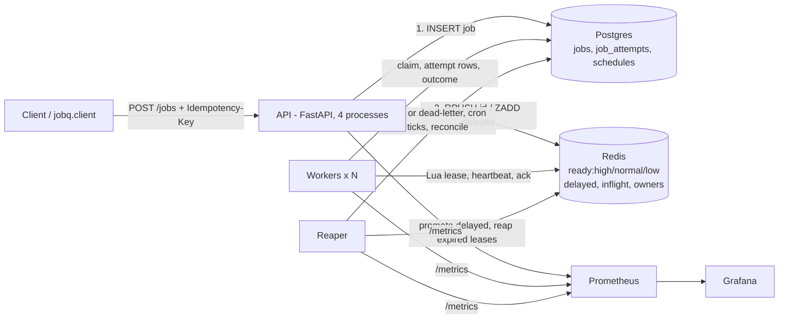
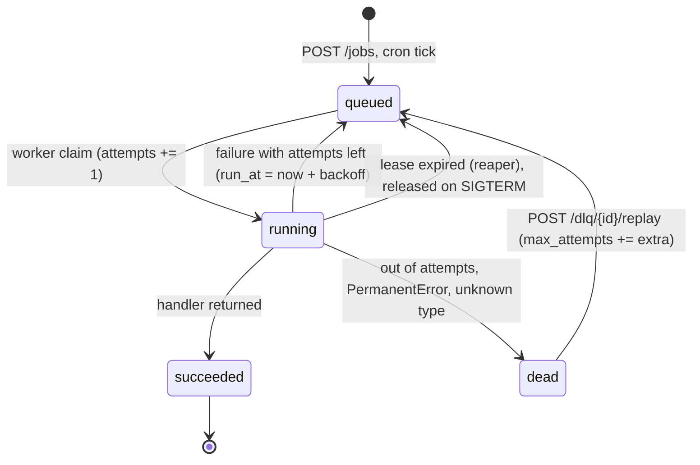

# jobq design

## Architecture



| Process | Responsibility |
|---|---|
| `api` (`uvicorn jobq.api:app`) | Enqueue (idempotent, backpressure), job status, DLQ inspect and replay, schedules CRUD, `/metrics` |
| `worker` (`jobq-worker`) | Lease, claim, run the handler with heartbeats, record the outcome, retry or dead-letter, release on `SIGTERM` |
| `reaper` (`jobq-reaper`) | Promote due delayed jobs (every 0.1 s), reap expired leases (1 s), fire cron schedules (1 s), reconcile Redis against Postgres (30 s), publish queue gauges (2 s) |

## Job lifecycle



```mermaid
sequenceDiagram
  participant A as API
  participant P as Postgres
  participant R as Redis
  participant W as Worker
  participant Re as Reaper
  A->>P: INSERT job (queued) ON CONFLICT (idempotency_key) DO NOTHING
  A->>R: RPUSH ready:{priority} id
  W->>R: Lua: LPOP ready:*, ZADD inflight (now+lease), HSET owners
  W->>P: UPDATE … SET running, attempts+1 WHERE status='queued'; INSERT attempt
  loop every lease/3
    W->>R: Lua: extend lease if owner matches
  end
  alt success
    W->>P: UPDATE … succeeded WHERE status='running' AND attempts=N
  else failure, attempts left
    W->>P: attempt failed; job queued, run_at = now + full_jitter(N)
    W->>R: ZADD delayed
    Re->>R: Lua: move due delayed ids to ready
  else out of attempts
    W->>P: attempt failed; job dead
  end
  W->>R: Lua: ack if owner matches
  Note over W,Re: If the worker dies, its lease expires.<br/>The reaper marks the attempt lease_expired,<br/>applies the retry policy and pushes the id again.
```

## Data model

| Table | Key columns | Notes |
|---|---|---|
| `jobs` | `id`, `type`, `payload jsonb`, `priority` (0 high, 1 normal, 2 low), `status`, `attempts`, `max_attempts`, `run_at`, `idempotency_key` (unique), `result jsonb`, `last_error`, `created_at`, `updated_at` | `attempts` only goes up. It numbers attempt rows and is the fencing token. |
| `job_attempts` | `job_id`, `attempt_number` (unique per job), `worker_id`, `started_at`, `finished_at`, `outcome`, `error` | `outcome`: `succeeded`, `failed`, `lease_expired`, `released`, or NULL while running. |
| `schedules` | `name` (PK), `cron`, `job_type`, `payload`, `priority`, `max_attempts`, `enabled`, `next_run_at`, `last_enqueued_at` | Fired by the reaper, once per tick. |

## Redis keys (prefix `jobq:`)

| Key | Type | Meaning |
|---|---|---|
| `ready:high`, `ready:normal`, `ready:low` | list | Job ids ready to run. The lease script checks them in that order. |
| `delayed` | sorted set | Member `"{priority}:{id}"`, score = `run_at`. Holds delayed jobs and retries in backoff. |
| `inflight` | sorted set | Member `id`, score = lease expiry (Redis `TIME`). |
| `owners` | hash | `id -> lease token`. Heartbeat and ack check it. |

## Guarantees and where they stop

- **No lost acceptances.** A `201` means the row is committed in Postgres. Every path that
  could leave it out of Redis is repaired by the reaper or the reconciler (ADR 0004).
- **No lost jobs on worker crash.** An expired lease is reclaimed and retried. Tested by
  killing a worker every 10 s across 10,000 jobs (README, Results).
- **No duplicate effect from duplicate delivery.** The claim only succeeds from `queued`,
  and results are fenced on the attempt number.
- **Where it stops.** A handler can still run twice if the worker dies after the side
  effect but before writing the result, or if the lease expires during a stall. Handlers
  must be idempotent, keyed on the job id or a business key (ADR 0001).

## Metrics

| Metric | Source |
|---|---|
| `jobq_jobs_enqueued_total{priority}`, `jobq_enqueue_rejected_total`, `jobq_enqueue_duplicates_total`, `jobq_enqueue_push_failed_total` | API |
| `jobq_jobs_started_total{type}`, `jobq_jobs_finished_total{type,outcome}`, `jobq_enqueue_to_start_seconds`, `jobq_job_duration_seconds{type}`, `jobq_leases_lost_total` | workers |
| `jobq_queue_depth{priority}`, `jobq_delayed_jobs`, `jobq_inflight_jobs`, `jobq_dlq_size`, `jobq_jobs{status}`, `jobq_leases_expired_total`, `jobq_reconciled_total`, `jobq_scheduled_jobs_total` | reaper |

Prometheus finds every worker replica through Docker DNS (`dns_sd_configs` on the
`worker` service name). The Grafana dashboard lives in `ops/grafana/dashboards/jobq.json`
and is provisioned at startup.

## Scaling notes (what to change at 10x)

- **Postgres commits.** Each job costs two commits (claim, complete), and `WALWrite`
  waits showed up at 8 workers. Batch completions, or let workers lease several jobs per
  round trip.
- **Reconciler.** It reads every id in Redis on each pass. Replace that with an outbox
  table or an indexed set of queued ids.
- **Redis.** A single primary holds all queues. Shard the ready lists by job type, or move
  to Redis Cluster with hash tags per queue.
- **Workers.** Each process runs one job at a time. I/O-bound handlers would benefit from
  running several jobs concurrently in one process.
