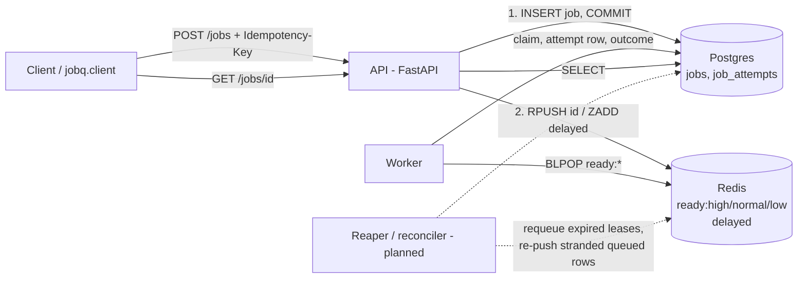

# jobq design

Status: **Week 1**. The API, a single worker, the Postgres schema and the happy path
work end to end. Sections marked *planned* describe where Week 2+ code plugs in.

## Architecture



## Job lifecycle (Week 1)

```mermaid
sequenceDiagram
  participant C as Client
  participant A as API
  participant P as Postgres
  participant R as Redis
  participant W as Worker
  C->>A: POST /jobs {type, payload}
  A->>P: INSERT jobs (status=queued) ON CONFLICT (idempotency_key) DO NOTHING
  A->>P: COMMIT
  A->>R: RPUSH ready:{priority} id   (or ZADD delayed if run_at in future)
  A-->>C: 201 {id, status: queued}
  W->>R: promote due delayed ids (Lua), then BLPOP ready:high, ready:normal, ready:low
  R-->>W: id
  W->>P: UPDATE jobs SET status=running, attempts+=1 WHERE id=? AND status=queued
  W->>P: INSERT job_attempts (attempt_number, worker_id, started_at)
  W->>W: run handler(payload)
  W->>P: UPDATE job_attempts outcome; UPDATE jobs status=succeeded|failed, result/last_error
  W->>R: ack (no-op until leases)
  C->>A: GET /jobs/{id}
  A-->>C: {status: succeeded, result}
```

## Data model

| Table | Key columns | Notes |
|---|---|---|
| `jobs` | `id uuid`, `type`, `payload jsonb`, `priority smallint` (0=high, 1=normal, 2=low), `status`, `attempts`, `max_attempts`, `run_at`, `idempotency_key` (unique), `result jsonb`, `last_error`, `created_at`, `updated_at` | `status IN (queued, running, succeeded, failed, dead)`. Index on `(status, run_at)` for the reconciler. |
| `job_attempts` | `id`, `job_id` (FK), `attempt_number`, `worker_id`, `started_at`, `finished_at`, `outcome`, `error` | One row per claim. `(job_id, attempt_number)` unique. `outcome` is NULL while running. |

## Redis keys (prefix `jobq:`)

| Key | Type | Meaning |
|---|---|---|
| `ready:high`, `ready:normal`, `ready:low` | list | Job ids ready to run. `BLPOP` across all three in that order gives strict priority. |
| `delayed` | sorted set | Member `"{priority}:{id}"`, score = `run_at` epoch seconds. A Lua script moves due members to their ready list. |
| `inflight` (*planned, Week 2*) | sorted set | Score = lease expiry. Lease, heartbeat, ack and reap are all Lua scripts. |

## Guarantees

- **No lost acceptances:** a `201` means the row is committed in Postgres.
- **At-least-once dispatch, with a guard against duplicates:** the conditional
  `queued → running` UPDATE means a duplicate delivery never starts a second attempt.
  Handlers must still be idempotent for the crash-after-side-effect case. See
  [ADR 0001](adr/0001-redis-broker-postgres-truth-at-least-once.md).
- **Known Week 1 gap:** `BLPOP` removes the id on delivery. If a worker crashes mid-job,
  the job stays `running` forever. Leases plus the reaper (Week 2) close this gap.

## Extension points (where Week 2+ code goes)

| Feature | Hook |
|---|---|
| Retries, backoff, DLQ | `Worker._record_failure` in `src/jobq/worker.py` (marked `YOUR TURN`) |
| DLQ endpoints | marked in `src/jobq/api.py` |
| Leases and heartbeats | `Broker.dequeue` / `Broker.ack` in `src/jobq/broker.py` |
| Reaper and reconciler | new process. Uses `ix_jobs_status_run_at` to find `queued` rows to re-push |
| Graceful shutdown | `Worker.run_forever` (stops between jobs today) |
| Backpressure (429) | `Broker.depth()` in `POST /jobs` |
| Extra handlers (e.g. Project 3) | `@registry.handler("name")` in a module listed in `JOBQ_HANDLER_MODULES` |
